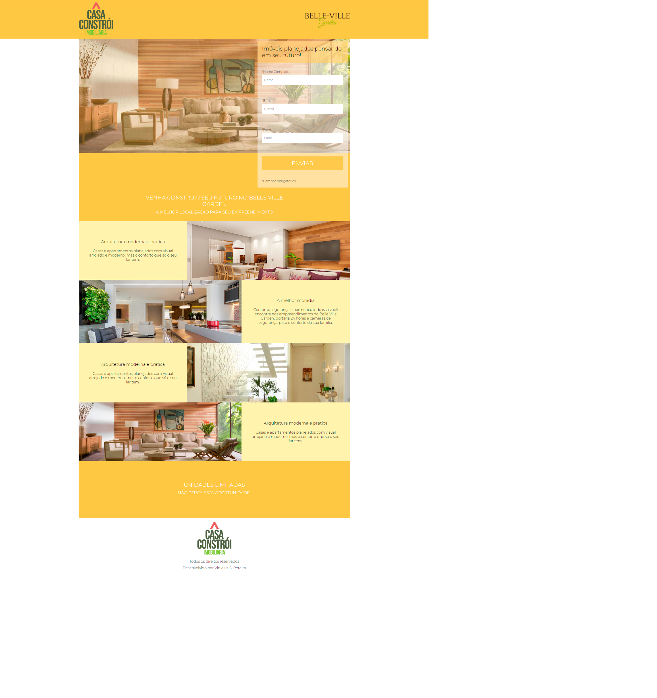

# Projeto-2
## Sobre o projeto
O projeto teve como finalidade implementar as boas praticas de design responsivo em uma Landing Page para o anúncio de um empreendimento imobiliário. O foco do projeto é ter uma página simples e responsiva para apresentar o empreendimento, com foco na captação de dados do cliente que demonstre interesse, através do Form. Foi implementado também um Slider automático via javascript que mostra imagens do empreendimento no topo da página.  

## Imagens do Desktop Viewport

## Imagens do Mobile Viewport

